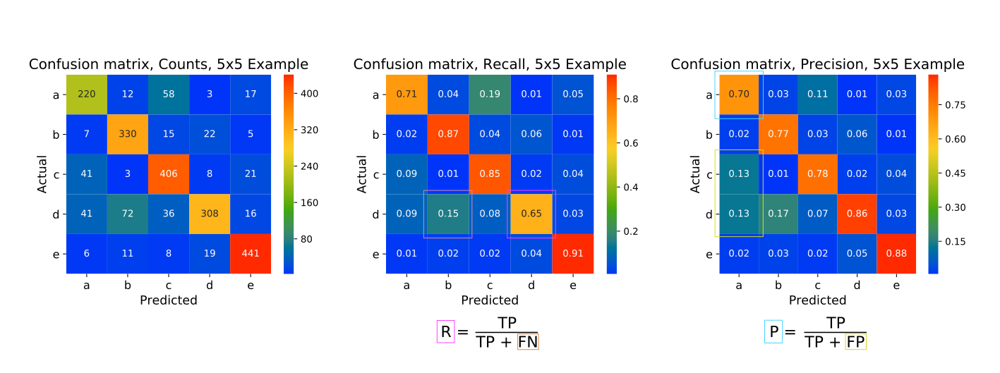

# Mlib

Library of oft-used functionalities for pandas, matplotlib, and data science in general.

This consists of three sections:

* [`plotHelpers`](#plothelpers) &mdash; nice-looking plot routines
* [`utility`](*utility) &mdash; all sorts of helpers that don't fit into a specific bucket
* [`stats`](*stats) &mdash; functions statistical in nature

## `plotHelpers`

### `timeUsage()`

A decorator for timing other functions. Output format adjusts for times
larger than a minute, larger than an hour.

### `plotConfusionMatrix()`

Makes pretty plots of confusion matrix data.

Especially nice: has counts, recall and precision variants.

When `type == 'recall'`, normalization across predicted values ensures that diagonal elements represent recall for each class.
When `type == 'precision'` normalizes across actual values ensures that diagonal elements represent class precisions.
(For recall and precision, max values are 1.0.)

In the example above, the left panel is a standard confusion matrix, showing counts assigned by predictions and reality.

Each *row* of the middle panel sums to 1.0, with the recall score in the corresponding diagonal element.
False negative counts, where predictions fall to the left or right of the diagonal, show where recall is "leaked" to other classes. (Recall for class 'd' is 0.65, with the largest error being false predictions to class 'b'.)

In the right panel *columns* sum to 1.0, with precision scores along the diagonal.
False positive counts, above or below a diagonal, show the classes from which precision is diluted.
(Precision of class 'a' is diluted by counts belonging mainly to classes 'd' and 'e'.)

### `detailedHistogram()`

Used for cases where you want a bin for each value of your data (best if integers).

Suppose we have an array of integer values.
These are counted by values, and bins are constructed on the range [-0.5, max(values) + 0.5], so the frequency of every value is shown in its own bin.

### `plotValueCounts()`

For use with Pandas.DataFrame types.
Provide the name of a column containing a modest number of distinct values (e.g., categoricals), and this will create a bar chart showing the counts of each value. (Like a `detailedHistogram()`, except does not include 'empty' bins, and is most appropriate for categoricals.

### `dependencePlot()`

***Not completed***

A version of `shap.dependence_plot()`, which will have a provision for including indices of data values that the user wants to highlight (for local interpretability).

Note: Shapley values, originally from collective game theory, are a strong measure of a feature's contribution to a given target value.
These plots illustrate Shapley values over an entire test set.

## `utility`

### `timeUsage()`

A decorator for timing other functions. Output format adjusts for times
larger than a minute, larger than an hour.

### `splitDataFrameByClasses()`

Conducts train/test splits of a pandas DataFrame separately for each class, and then concatenates the results together.

*This is especially useful for very un-balanced classes, where the statistics do not guarantee the split ratios for the smaller classes when done on the DataFrame as a whole.*

### `splitBalanceDataFrameByClasses()`

Conducts train/test splits of df separately for each class, then balances the classes of the training splits, and concatentates together.
Balancing is done by sampling *with* replacement when the *training* set for a class is < targetClassSize, and sampling *without* replacement when it is > targetClassSize.

*This is especially useful for very un-balanced classes, where the statistics do not guarantee the split ratios for the smaller classes when done on the DataFrame as a whole.*

Returns dfTrain, dfTest, where the testFrac ratio corresponds to the splits prior to balancing dfTr classes.
 
This should only be useful in cases where the model being trained does not have a built-in `class='balanced'` option; for such cases, use `splitDataFrameByClasses()` instead.
